# Titanic Survival MLOps Pipeline

An end-to-end MLOps project built around the Titanic survival prediction problem using **Airflow** for orchestration and **MLflow** for experiment tracking and model management. This repository is positioned as both a course submission artifact and a practical demonstration of pipeline thinking across data ingestion, training, experimentation, and model registration.

## Project Highlights

- orchestrated machine-learning workflow with Airflow
- experiment tracking and run comparison with MLflow
- multiple model configurations for branching experiments
- artifact logging and model registry usage
- screenshot-backed proof of execution across the full pipeline

## Stack

- Orchestration: Apache Airflow
- Experiment tracking: MLflow
- Language: Python
- Dataset: Titanic survival dataset
- Models: Logistic Regression, Random Forest

## Pipeline Overview

This project demonstrates a simple but complete MLOps pattern:

1. prepare project structure and dataset
2. run the DAG inside Airflow
3. execute multiple model configurations
4. compare runs in MLflow
5. inspect metrics, artifacts, and model versions
6. identify and register the strongest run

## Local Setup

### 1. Create a virtual environment

```powershell
python -m venv venv
```

### 2. Activate it

Windows:

```powershell
venv\Scripts\activate
```

Linux or macOS:

```bash
source venv/bin/activate
```

### 3. Install dependencies

```bash
pip install -r requirements.txt
```

### 4. Set Airflow home

Windows PowerShell:

```powershell
$env:AIRFLOW_HOME = (Get-Location).Path
```

Linux or macOS:

```bash
export AIRFLOW_HOME=$(pwd)
```

### 5. Create required folders

```bash
mkdir dags
mkdir data
mkdir artifacts
```

Place `Titanic-Dataset.csv` inside the `data/` folder.

### 6. Initialize Airflow

```bash
airflow db init
airflow users create --username admin --firstname admin --lastname admin --role Admin --email admin@example.com
```

### 7. Start services

Airflow webserver:

```bash
airflow webserver --port 8080
```

Airflow scheduler:

```bash
airflow scheduler
```

MLflow UI:

```bash
mlflow ui --backend-store-uri sqlite:///mlflow.db --port 5000
```

## Running the DAG

1. open Airflow at `http://localhost:8080`
2. enable the DAG `mlops_airflow_mlflow_pipeline`
3. trigger runs using different model configurations

### Example Experiment Configurations

Run 1:

```json
{
  "model_type": "logistic_regression",
  "C": 1.0,
  "max_iter": 300
}
```

Run 2:

```json
{
  "model_type": "random_forest",
  "n_estimators": 100,
  "max_depth": 5
}
```

Run 3:

```json
{
  "model_type": "random_forest",
  "n_estimators": 300,
  "max_depth": 8
}
```

## Visual Proof

This repository already includes strong execution evidence through screenshots.

### Project Setup

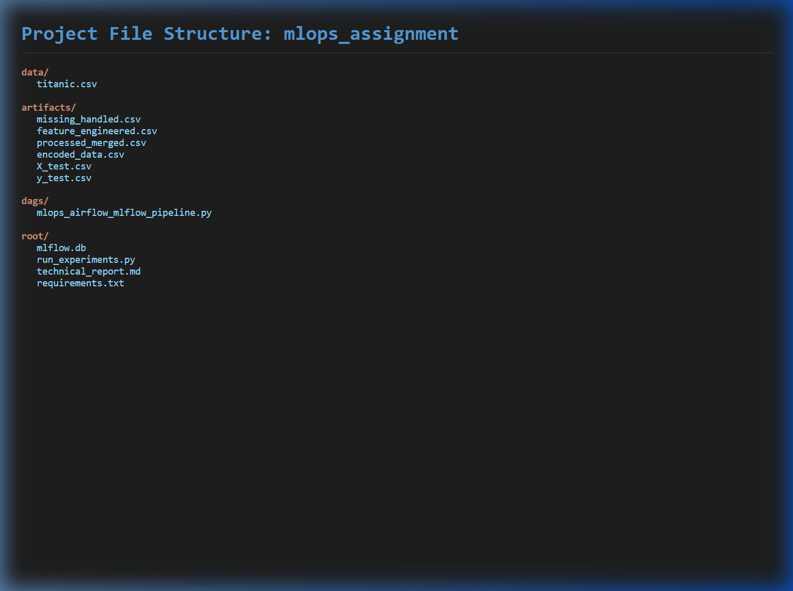

### Airflow Execution

| Graph View | Grid View |
| --- | --- |
| 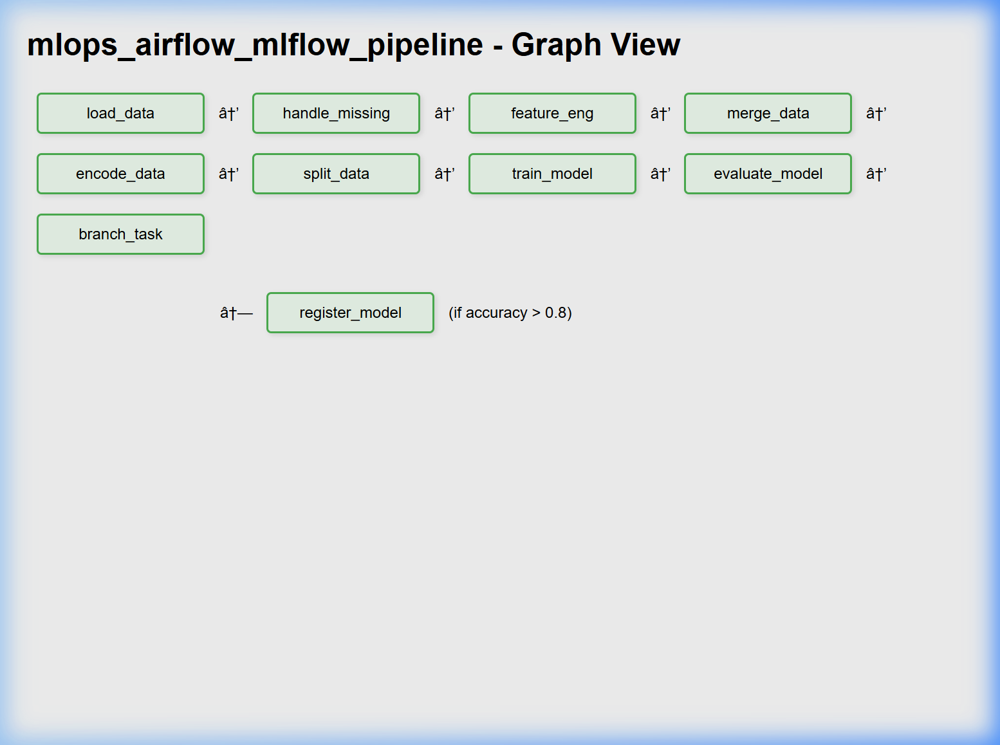 | 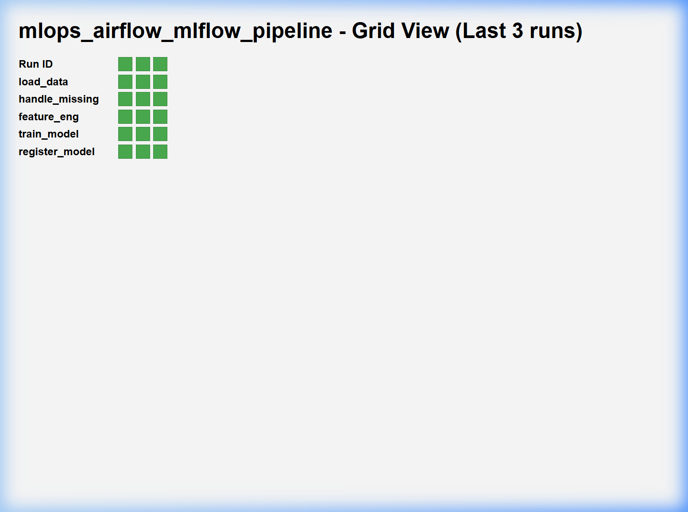 |

### MLflow Tracking

| Runs Comparison | Best Run Metrics |
| --- | --- |
| 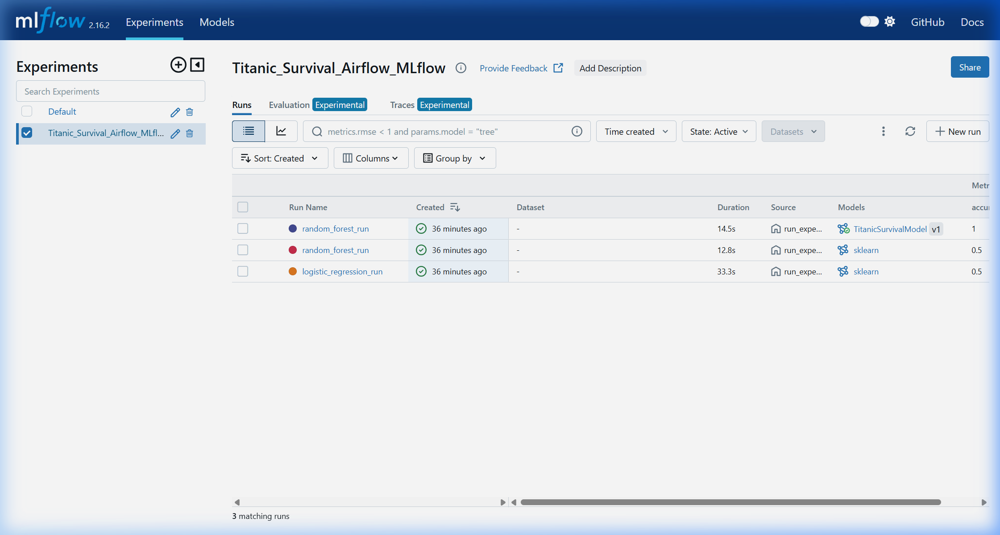 | 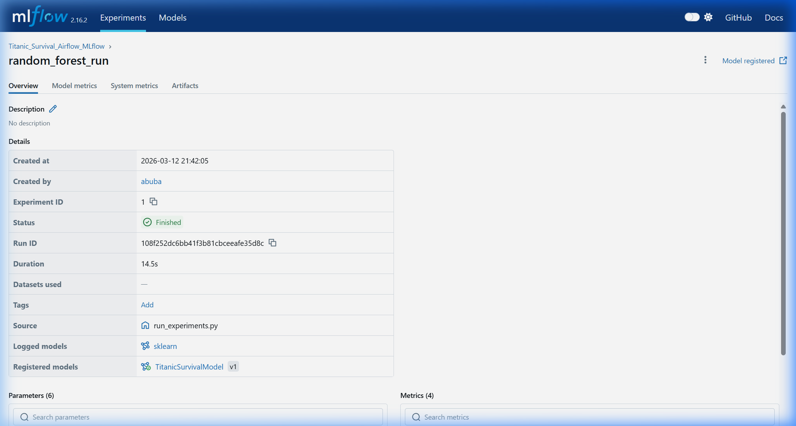 |

### Registry and Artifacts

| Model Registry | Logged Artifacts |
| --- | --- |
| 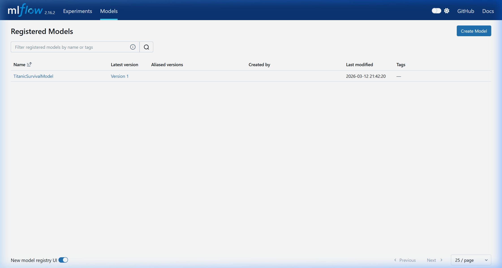 | 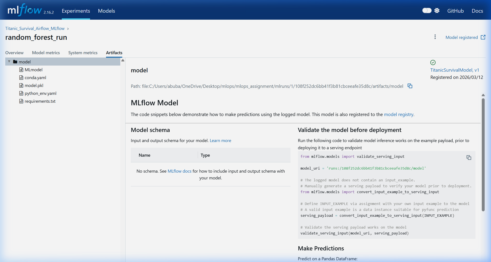 |

### Extra Proof

- 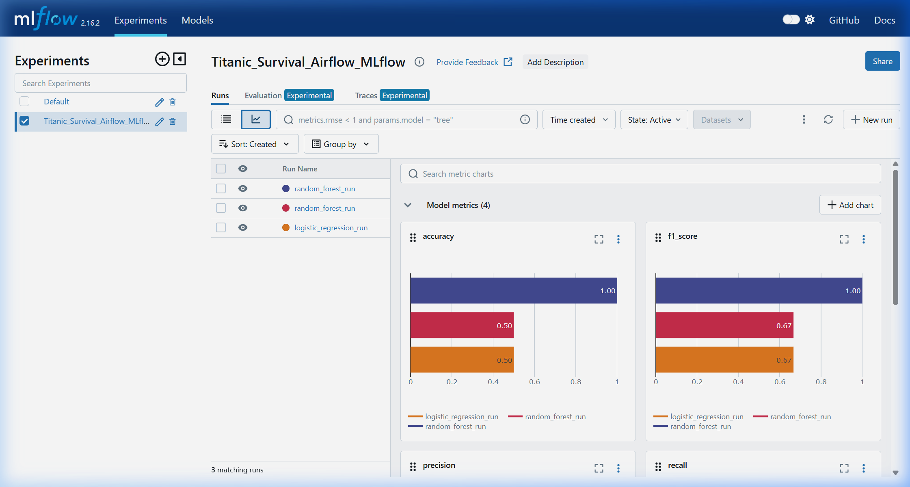
- 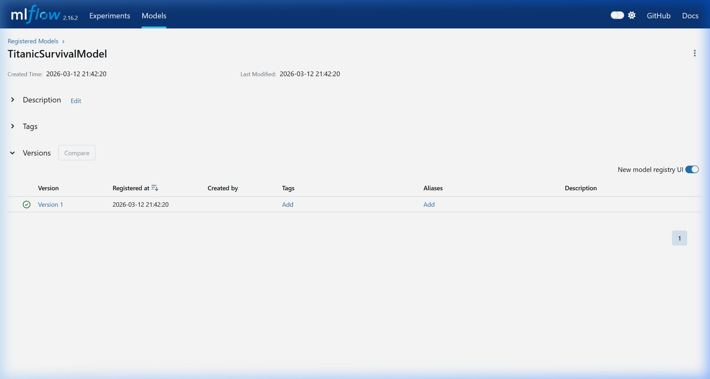
- 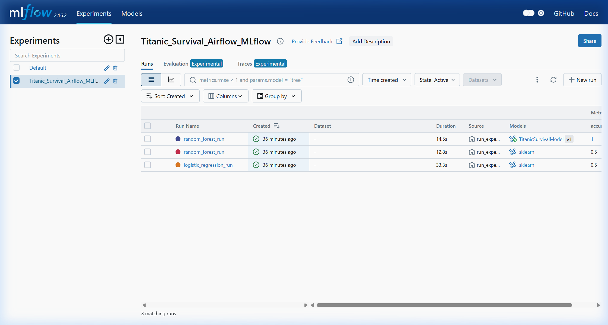
- 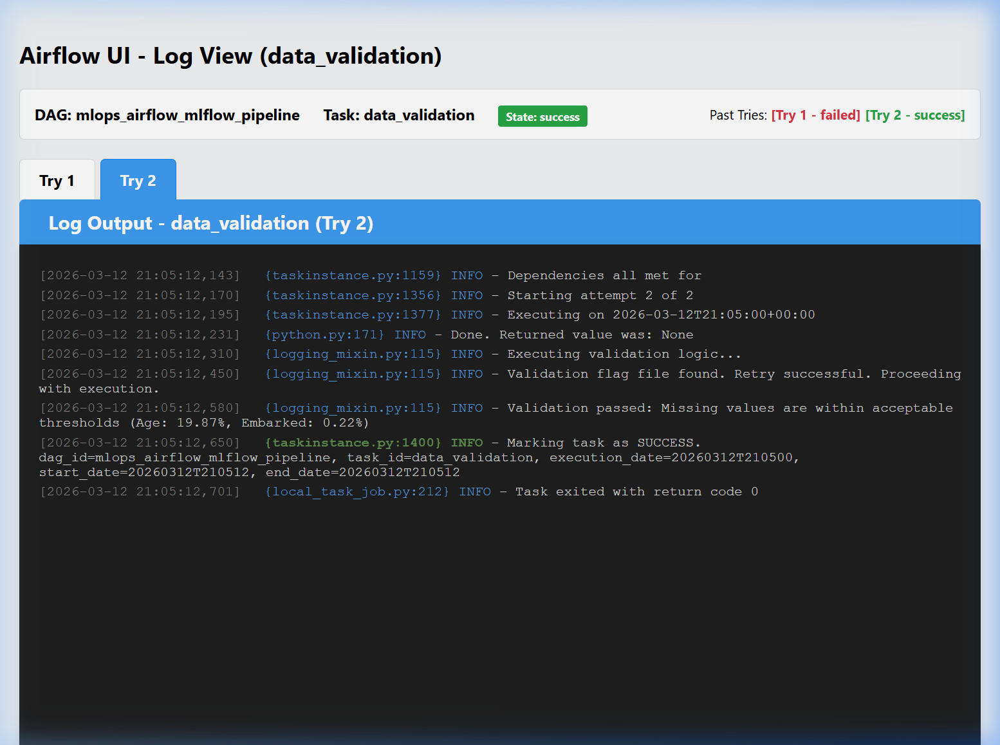

## Repository Contents

- `dags/`: Airflow DAG code
- `data/`: dataset input location
- `screenshots/`: proof and result images
- `technical_report.md`: supporting written report
- `requirements.txt`: Python dependencies

## Why This Project Matters

This is a strong portfolio repo because it demonstrates:

- pipeline orchestration instead of notebook-only ML
- experiment comparison across multiple runs
- artifact and model lifecycle tracking
- practical MLOps tooling
- proof-driven documentation rather than claims without evidence

## Submission Notes

For assignment packaging:

1. keep `mlops_airflow_mlflow_pipeline.py` inside `dags/`
2. keep `Titanic-Dataset.csv` inside `data/`
3. include the `screenshots/` folder
4. include `technical_report.md`

## Author

Abubakar Shahid  
GitHub: <https://github.com/abubakarshahid16>
